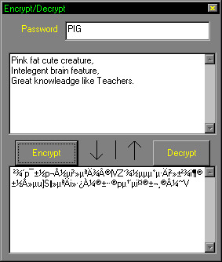



## Another EASY Encrypt\_Decrypt Code

### Description

Encrypts and decrypts text easily.It works by adding up the character code of the password and the text.E.G. Password="a" which chr code is 97 and the Text="b" which chr code is 98, the encrypted text will be "Ã" which chr code is 195.

hope you like it.
 
### More Info
 

             |
---                |---
**Submitted On**   |2002-10-26 02:28:58
**By**             |[ISIEO](https://github.com/Planet-Source-Code/PSCIndex/blob/master/ByAuthor/isieo.md)
**Level**          |Intermediate
**User Rating**    |3.7 (11 globes from 3 users)
**Compatibility**  |VB 3\.0, VB 4\.0 \(16\-bit\), VB 4\.0 \(32\-bit\), VB 5\.0, VB 6\.0
**Category**       |[Encryption](https://github.com/Planet-Source-Code/PSCIndex/blob/master/ByCategory/encryption__1-48.md)
**World**          |[Visual Basic](https://github.com/Planet-Source-Code/PSCIndex/blob/master/ByWorld/visual-basic.md)
**Archive File**   |[Another\_EA14872310262002\.zip](https://github.com/Planet-Source-Code/isieo-another-easy-encrypt-decrypt-code__1-40162/archive/master.zip)

